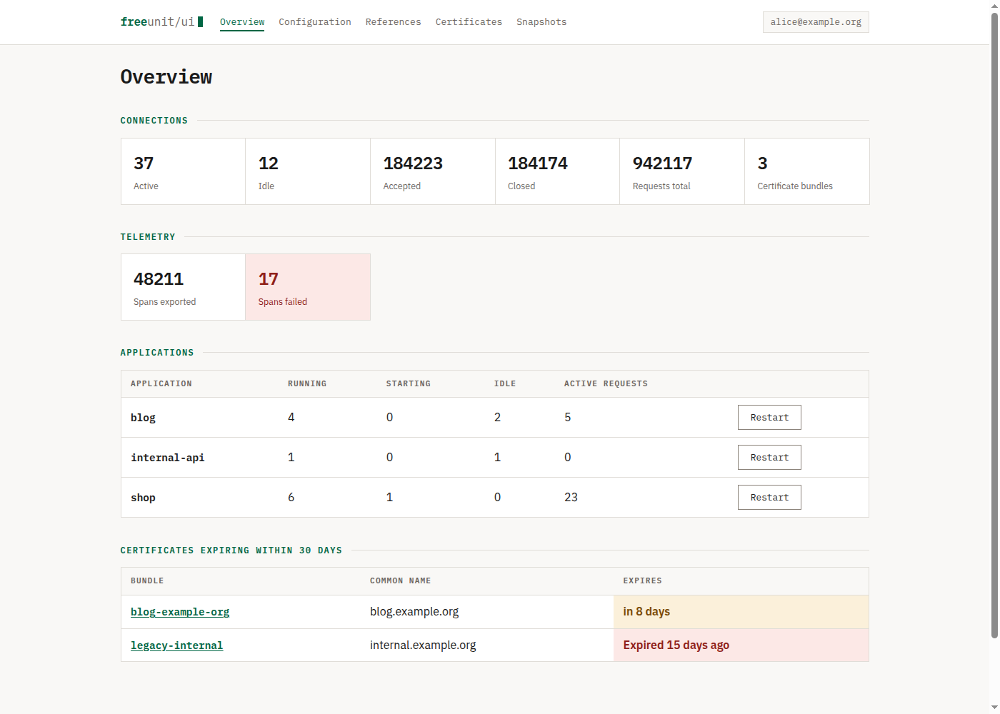
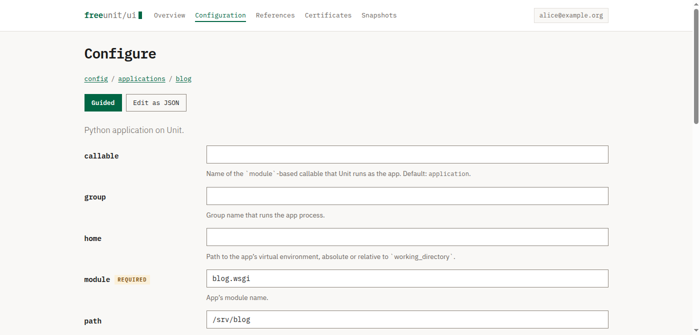
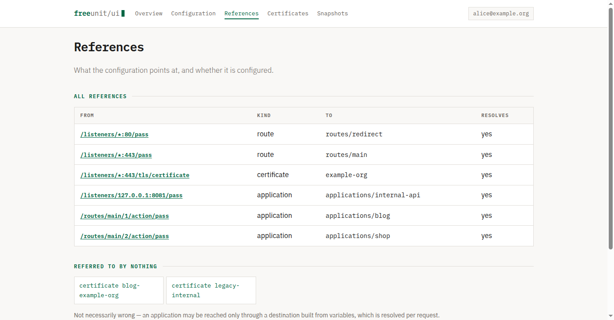
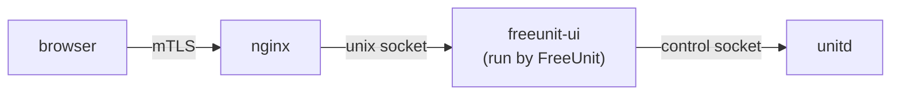

# FreeUnit UI

A web interface for the [FreeUnit](https://github.com/freeunitorg/freeunit) control API, the
community LTS fork of NGINX Unit.

[](LICENSE)


Unit is configured entirely through a JSON REST API rather than config files, which makes it
excellent to automate and awkward to inspect. Every "nginx GUI" project out there targets classic
nginx config files, and none of them speak this API. FreeUnit UI reads it directly: runtime
status, the full configuration tree, and certificate expiry, rendered as pages instead of `curl`
output piped through `jq`.



## Read this before you install it

Writing FreeUnit configuration is equivalent to root. A configuration document can define an
application with an arbitrary `executable` and `user`, so anything able to write config can run
arbitrary code. Even read access exposes your full server configuration, including which
certificates and applications exist.

Consequently:

- **This interface authenticates nobody.** Put it behind something that does: a reverse proxy
  with client certificates, OIDC, or an SSO forward-auth endpoint. It can read the identity that
  proxy asserts, show it, record it against configuration changes, and refuse requests that
  arrive without one, but the proxy is what decides who gets in.
- **It binds to `127.0.0.1` by default.** Do not expose it directly to a network.
- Since FreeUnit 1.36.0 the UNIX control socket only accepts peers whose effective UID is root or
  the user unitd runs as, so this process must run as one of them. A compromise of this interface
  is therefore a compromise of unitd. Treat it as privileged software.

Read-only is the default for that reason: with writes off, the mutating routes are never
registered, and the read path is built on a client class that has no write method on it at all.

## Requirements

- Python 3.11 or newer
- FreeUnit or NGINX Unit with a reachable control socket
- FreeUnit 1.36.1 or newer for JSON Pointer error locations (older releases work, with less
  precise error reporting)

## Quick start

Not published to a package index yet, so build it from a checkout:

```console
$ python -m venv .venv && . .venv/bin/activate
$ pip install -e .
$ FREEUNIT_UI_CONTROL=/run/freeunit.sock freeunit-ui
```

Then open <http://127.0.0.1:8099/>. `freeunit-ui` runs Flask's development server: fine for a
look around, not for anything else. See [docs/deployment.md](docs/deployment.md) for a real
deployment.

No FreeUnit instance handy? Skip straight to it:

```console
$ python tools/demo.py --writes --user alice@example.org
```

That runs the interface against a fake control API with realistic data (an application in each of
three languages, a certificate expiring soon, one already expired) on the same
<http://127.0.0.1:8099/>.

## Two ways to configure



**Guided** renders the members the bundled specification describes as typed inputs: text,
numbers, true/false, and a menu where the value must be one of a set. **Edit as JSON** remains,
and is how you reach everything else. The two modes link to each other from every configuration
page.

The guided form **never replaces a document, it merges into it**. Objects, arrays, and members the
specification has never heard of are carried across untouched and named in the interface. A schema
that gains fields every release will eventually outrun any form built purely from types; the ones
that replace the document lose what they don't recognise, sooner or later.

A blank field removes an optional member; a required one is never removed, so the form cannot
produce a document it already knows is invalid.

<br clear="right">

## Configuration guidance

FreeUnit publishes an OpenAPI specification, and a copy is bundled here. Browsing shows what each
member means, which are required, and their defaults and permitted values, resolved for the right
application type since Python and PHP applications describe different shapes. Creating a listener
or application offers a starting point with the required members already present.

Editing also checks the document before it's sent: missing required members, values outside a
permitted set, members of the wrong type, and names the specification doesn't recognise, each
reported at a JSON Pointer the way unitd reports its own errors. A typo like `modul` shows up
twice, as a missing `module` and an unrecognised `modul`, which is exactly the signal you want.

Findings **warn and ask**, never refuse: an *Apply anyway* button, and a *Check* button to look
before applying. It is guidance, not a gate. unitd doesn't serve its own specification, so this
copy is pinned to one release and will drift from your server; nothing here can block an apply,
and unrecognised members are reported rather than removed.

## Beyond the configuration



**References** shows what listeners and routes point at and whether it resolves: the class of
mistake a schema can't catch, since it lives in the document rather than its shape. Destinations
built from request-time variables are reported as decided-per-request rather than broken.

**Snapshots**, taken automatically before every change, can be compared against the running
configuration or against each other, so a change is readable, not merely reversible.

**Applications** can be restarted from the overview. Not a configuration change: nothing is
stored, no snapshot is taken.

**Certificate bundles** upload by file or paste, replacing an existing bundle under the same name;
listeners referring to it pick up the new certificate with no configuration change at all. Key
material is never written to a snapshot and never echoed back into a form.

## Enabling configuration editing

```console
$ export FREEUNIT_UI_ENABLE_WRITES=true
$ export FREEUNIT_UI_SECRET_KEY="$(python -c 'import secrets; print(secrets.token_urlsafe(48))')"
```

The interface refuses to start with writes enabled and no key, rather than generating one. A
generated key would appear to work and then silently break CSRF protection across workers and
restarts.

With writes on, every change goes through the same sequence: the CSRF token is checked; the
subtree is re-read and compared against what the form was built from, since the control API offers
no `ETag` and two operators could otherwise silently overwrite each other; the whole configuration
is snapshotted, because the API has no undo; then the change is applied, with the error page
showing unitd's own JSON Pointer and typo suggestion if it refuses.

## Configuration

Every setting is an environment variable prefixed `FREEUNIT_UI_`.

| Variable | Default | Meaning |
| --- | --- | --- |
| `FREEUNIT_UI_CONTROL` | `/run/freeunit.sock` | Control socket path, or an `http://` URL for a TCP control socket |
| `FREEUNIT_UI_HOST` | `127.0.0.1` | Development server bind address |
| `FREEUNIT_UI_PORT` | `8099` | Development server port |
| `FREEUNIT_UI_TIMEOUT` | `10.0` | Control API request timeout, seconds |
| `FREEUNIT_UI_CERT_EXPIRY_WARNING_DAYS` | `30` | Highlight certificates expiring within this window |
| `FREEUNIT_UI_MAX_RENDER_CHARS` | `512000` | Truncate a rendered configuration document beyond this size |
| `FREEUNIT_UI_MAX_UPLOAD_BYTES` | `1048576` | Largest request body accepted, certificate uploads included |
| `FREEUNIT_UI_AUTH_HEADER` | — | Header the proxy sets with the operator's identity, e.g. `X-Forwarded-User` |
| `FREEUNIT_UI_REQUIRE_AUTH` | `false` | Refuse requests arriving without that identity |
| `FREEUNIT_UI_ENABLE_WRITES` | `false` | Allow configuration changes; read "Read this before you install it" first |
| `FREEUNIT_UI_SECRET_KEY` | — | Session signing key, required when writes are enabled |
| `FREEUNIT_UI_SESSION_COOKIE_SECURE` | `true` | Mark the session cookie Secure; turn off only for plain-HTTP loopback testing |
| `FREEUNIT_UI_SNAPSHOT_DIR` | `/var/lib/freeunit-ui/snapshots` | Where configuration is saved before each change |
| `FREEUNIT_UI_SNAPSHOT_KEEP` | `50` | Snapshots retained before pruning |

Distributions differ on the socket path: a Gentoo overlay package for FreeUnit might use
`/run/freeunit.sock`, while upstream packages commonly use `/var/run/control.unit.sock`.

## Deploying

The supported shape is FreeUnit serving this interface on a UNIX socket, with nginx in front doing
the authentication:



Working configuration for both sides is in [`deploy/`](deploy/), and
[docs/deployment.md](docs/deployment.md) walks through it, including why the listener is a UNIX
socket rather than a port, and the failure mode of letting the server host the interface that
configures it.

## Scope

In scope: reading and presenting what the control API exposes, making expiry, misconfiguration,
and runtime health legible, and editing configuration safely for operators who opt in.

Out of scope: being a PaaS, deploying applications, managing the host, or wrapping `unitctl`.

## Documentation

| | |
| --- | --- |
| [Architecture](docs/architecture.md) | How the pieces fit together, and why |
| [Deployment](docs/deployment.md) | Running it safely |
| [Security model](SECURITY.md) | Trust boundaries and how to report a vulnerability |
| [Contributing](CONTRIBUTING.md) | Development setup and expectations |

## License

Apache License 2.0, see [LICENSE](LICENSE): the same license FreeUnit itself uses.
